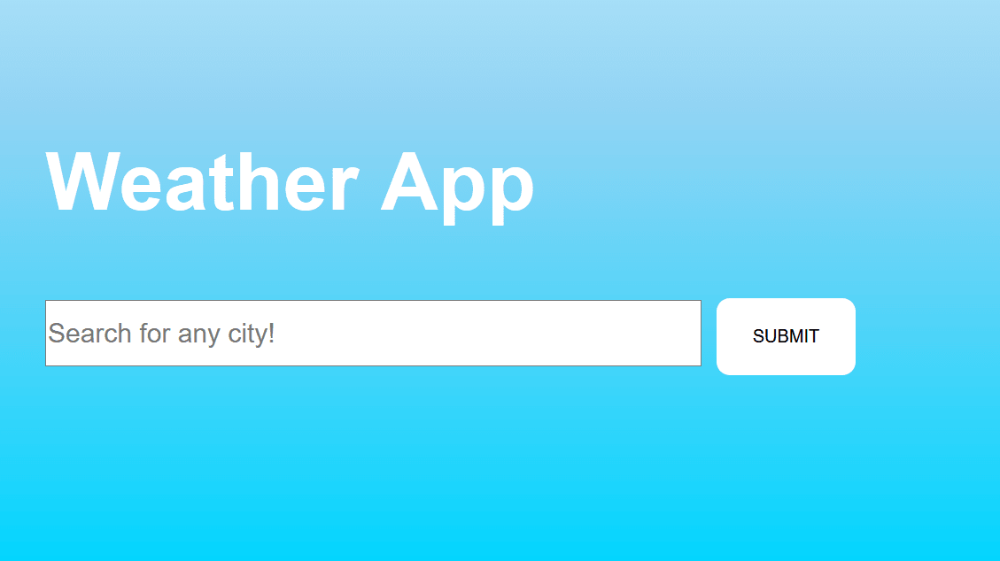
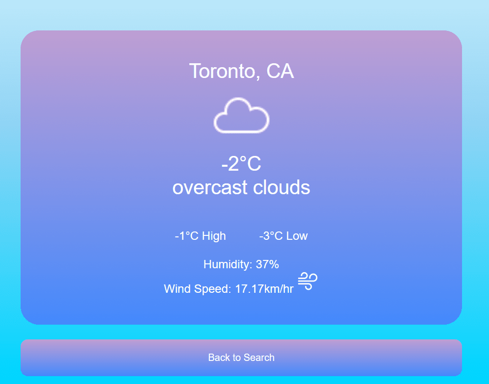
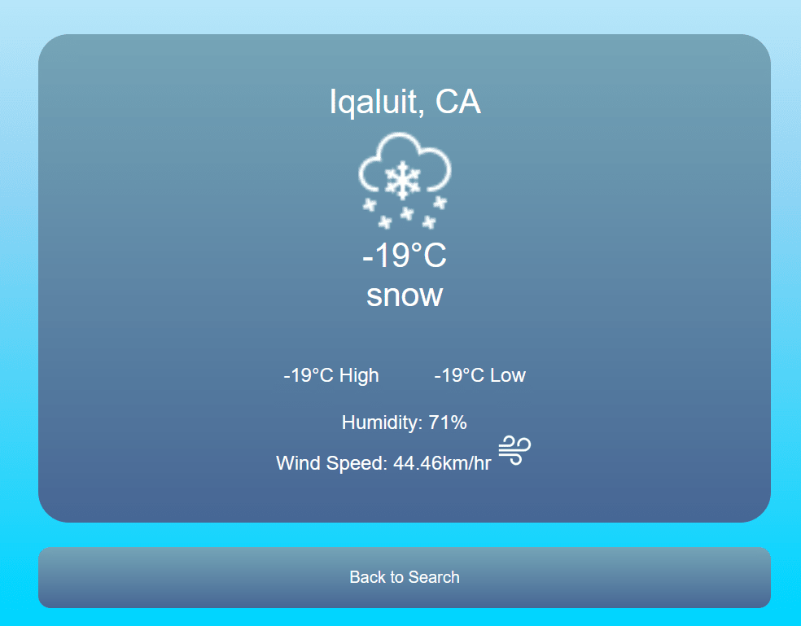
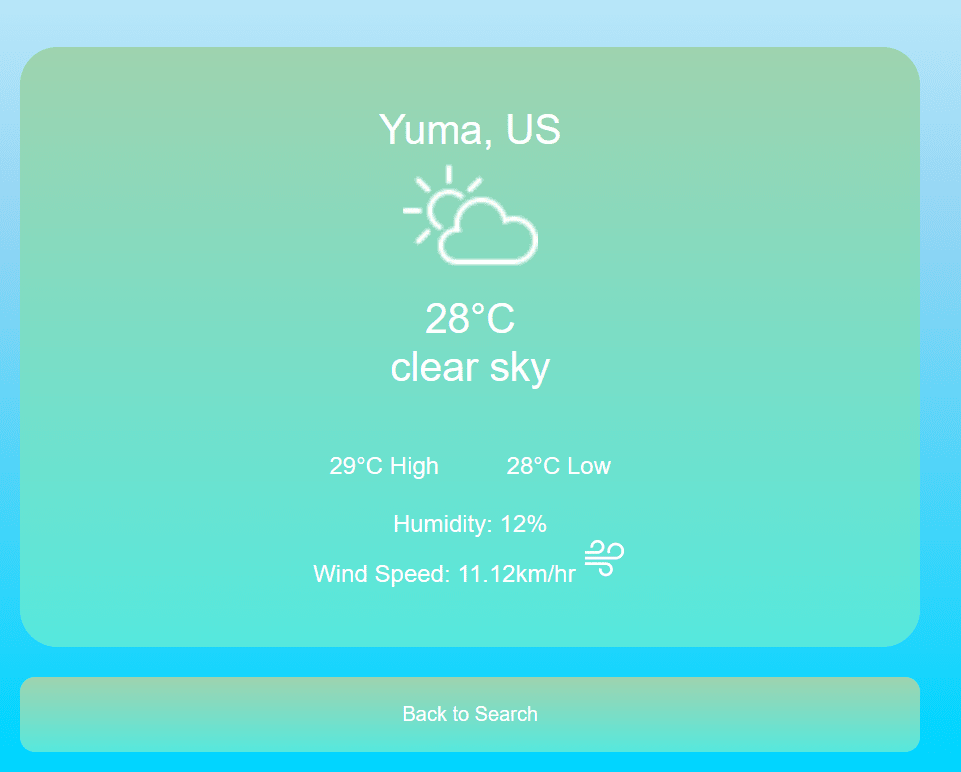

# WeatherApp
A Weather App created using CSS, HTML, and Javascript which utilizes the OpenWeather API to get accurate deatils about the weather from the city specified by the user. All icons are from icons8.com. 

# Functionality
- Changes background of the card which holds the information of the weather depending on the current weather conditions
- Handles errors when the user inputs a wrong city, request for them to try again
- Retrives data of the weather from a specific city using the OpenWeather API service
- The main data shown is the city's name, the country the city is located in, the current temperature, and a short description of the weather conditions
- Other details shown are the highest and lowest temperature, humidity, and wind speed

# Pictures of App

